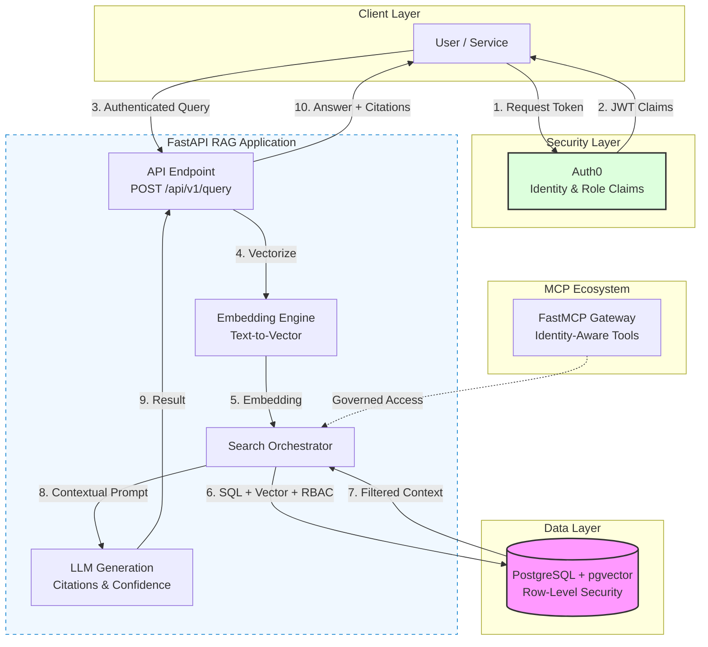
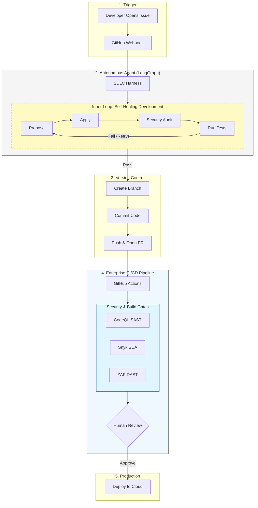
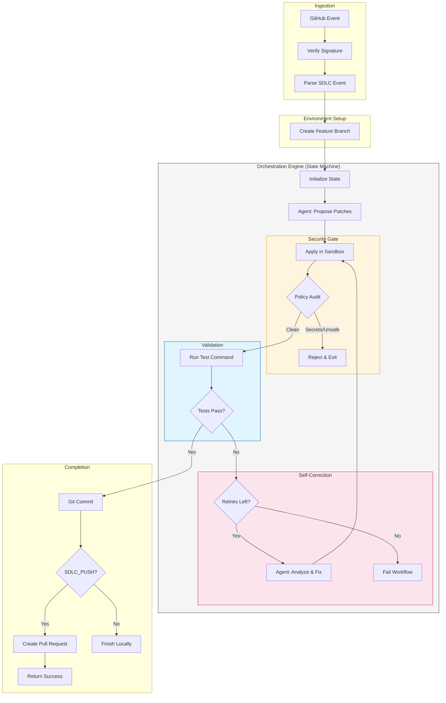

# 🛡️ Enterprise Zero-Trust RAG Microservice

<div align="center">

[](https://www.python.org/)
[](https://fastapi.tiangolo.com/)
[](https://www.postgresql.org/)
[](https://github.com/pgvector/pgvector)
[](https://auth0.com/)

**High-throughput retrieval-augmented generation with in-database RBAC and `pgvector`.**

</div>

---

### 👤 Architect
**[Ken Wong](https://www.linkedin.com/in/kenwong-architect/)**  
*Target stack: Python, FastAPI, PostgreSQL, pgvector, FastMCP, Auth0*

---

## 🚀 Live Architecture Artifacts

| Component | Description | Link |
| :--- | :--- | :--- |
| **Visual UI** | Shift-left RBAC Demo | [enterprise-rag-pgvector-rbac.streamlit.app](https://enterprise-rag-pgvector-rbac.streamlit.app) |
| **API Docs** | Live OpenAPI / Swagger | [enterprise-rag-api-ksez.onrender.com/docs](https://enterprise-rag-api-ksez.onrender.com/docs) |
| **Repository** | Auditable Source | [github.com/Kenono2000/enterprise-rag-pgvector-rbac](https://github.com/Kenono2000/enterprise-rag-pgvector-rbac) |

---

## 🏛️ System Architecture



**Core flow:** Auth0 issues identity and role claims → FastAPI generates a query embedding → `pgvector` performs a similarity search filtered by row-level role metadata → the LLM receives only authorized context → a typed response returns with citations and a confidence score.

---

## ✨ Key Features

### Governed Tool-Calling & CI/CD Evaluation Harness

An exploratory testbed evaluating the operational boundaries and failure modes of agentic tool-calling within software delivery pipelines.

#### Key Focus Areas
* **Bounded FastMCP Tool Contracts:** Exposing strictly typed schemas to LLM clients, preventing arbitrary shell command execution.
* **Context Hydration via pgvector:** Retrieving architecture decision records (ADRs) and interface specs deterministically via in-database RBAC rather than saturating context windows.
* **Automated Failure Triage:** Testing closed-loop failure triage by piping failing `pytest` logs and AST checks into the model to evaluate real-world code repair versus hallucinated fixes.
* **Token Budgeting & Auditability:** Tracking request IDs, token usage, and latency across all tool-calling invocations.

---

## 🏗️ Technical Deep Dive

### 1. In-Database Zero-Trust RBAC
Retrieval is not just about similarity; it is about **authority**.

- **Level:** Row-level security (RLS) simulation via metadata filtering.
- **Mechanism:** PostgreSQL `JSONB` indexing and the `?|` operator match JWT role claims against document `allowed_roles` **inside the vector search query itself**.
- **Benefit:** Prevents unauthorized data leakage by ensuring the LLM never sees context outside the caller's access domain.

### 2. Autonomous SDLC with LangGraph
The project implements a self-healing development loop.

- **State Machine:** Uses **LangGraph** to manage the cycle of `propose → apply → audit → test → repair`.
- **Security Gate:** An automated **Policy Engine** audits every proposed patch for secret leakage or unsafe imports before execution.
- **Resilience:** If tests fail, the agent receives the traceback and attempts to repair the code automatically (configurable retry limit).

### 3. High-Performance Vector Search
- **Engine:** `pgvector` with **HNSW** (Hierarchical Navigable Small World) indexing.
- **Optimized I/O:** Uses `asyncpg` for non-blocking database calls, critical for high-throughput microservices.
- **Validation:** Pydantic DTOs enforce strict schema validation for all RAG inputs and outputs.

### 4. Enterprise-Ready Architecture
- **Identity-Aware MCP:** FastMCP integration lets external tools/agents interact with the RAG system while respecting RBAC rules.
- **Modular Design:** Clear separation between the RAG microservice (`app/`) and the SDLC orchestration layer (`sdlc_harness/`).

---

## 🔁 Autonomous SDLC Lifecycle

This project demonstrates a full lifecycle autonomous development workflow, from issue ingestion to production deployment with security gates.



---

## 🧪 Local Development

### 1. Setup Environment
```powershell
# Create and activate virtual environment
python -m venv .venv
.\.venv\Scripts\Activate.ps1

# Install dependencies
pip install -r requirements.txt
```

### 2. Run Tests
```powershell
python -m pytest -q
```

### 3. Start Infrastructure & API
```powershell
# Start PostgreSQL with pgvector
docker compose up -d postgres

# Start the API with hot-reload
python -m uvicorn sdlc_harness_main:app --reload --port 8000
```

> 💡 **Note:** The API is available at `http://localhost:8000`, and interactive documentation is at `/docs`.

---

## 🧩 SDLC Harness Internals

The custom harness handles the fine-grained orchestration of patch application, security validation, and automated repair.



> **Note:** GitHub Actions is a better production runner for checkout, secrets, isolation, retries, logs, and PR integration. The custom harness remains useful for the agent, RAG context, and organization-specific governance logic.

### Example Payload
```json
{
  "issue": {
    "number": 125,
    "title": "Fix value",
    "body": "Update the value."
  },
  "repository": {
    "full_name": "Kenono2000/enterprise-rag-pgvector-rbac"
  },
  "patches": [
    {
      "file_path": "src/value.py",
      "content": "VALUE = 2\n"
    }
  ]
}
```

### Example Response
```json
{
    "status": "completed",
    "issue_id": "125",
    "branch": "feature/AGENT-125-fix-value",
    "tests": "python -m pytest -q",
    "pushed": true,
    "pull_request_url": "https://github.com/Kenono2000/enterprise-rag-pgvector-rbac/pull/1",
    "pull_request_created": true
}
```

---