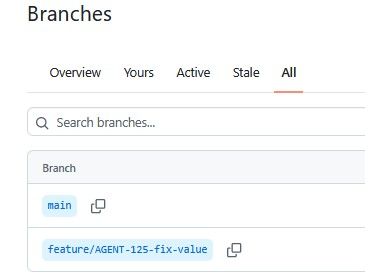
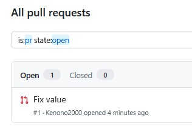

# 🛡️ Enterprise Zero-Trust RAG Microservice

**High-Throughput Retrieval-Augmented Generation with In-Database RBAC & `pgvector`**

**Architect:** [Ken Wong](https://www.linkedin.com/in/kenwong-architect/)  
**Target Stack:** Python, FastAPI, PostgreSQL, `pgvector`, FastMCP, Auth0

---
## What this project demonstrates

- Secure RAG retrieval with PostgreSQL, `pgvector`, and database-side role filtering.
- FastAPI endpoints with typed responses, citations, and confidence scores.
- FastMCP tools for identity-aware retrieval and governed code changes.
- A bounded SDLC workflow with patch validation, tests, Git commits, and optional PR creation.

## Local development

Install dependencies and run the tests:

```powershell
python -m venv .venv
.\.venv\Scripts\Activate.ps1
pip install -r requirements.txt
python -m pytest -q
```

Start PostgreSQL and the API:

```powershell
docker compose up -d postgres
python -m uvicorn sdlc_harness_main:app --reload --port 8000
```

The API is available at `http://localhost:8000`; interactive documentation is at `/docs`.

## SDLC workflow

The custom harness accepts `POST /webhooks/github`, validates typed patch proposals, runs security checks and tests, then creates a branch and commit. Set `SDLC_PUSH=true`, `GITHUB_TOKEN`, and `GITHUB_BASE_BRANCH` in an untracked `.env` file only when you want to push and open a PR. Keep `SDLC_PUSH=false` for local testing.

GitHub Actions is a better production runner for checkout, secrets, isolation, retries, logs, and PR integration. The custom harness remains useful for the agent, RAG context, and organization-specific governance logic.

Example payload:

```json
{
  "issue": {"number": 125, "title": "Fix value", "body": "Update the value."},
  "repository": {"full_name": "Kenono2000/enterprise-rag-pgvector-rbac"},
  "patches": [{"file_path": "src/value.py", "content": "VALUE = 2\n"}]
}
```

Example response:

```json
{
    "status": "completed",
    "issue_id": "125",
    "branch": "feature/AGENT-125-fix-value",
    "tests": "python -m pytest -q",
    "pushed": true,
    "pull_request_url": "https://github.com/Kenono2000/enterprise-rag-pgvector-rbac/pull/1",
    "pull_request_created": true
}
```

## GitHub Workflow Evidence

### Generated branch



### Pull request

