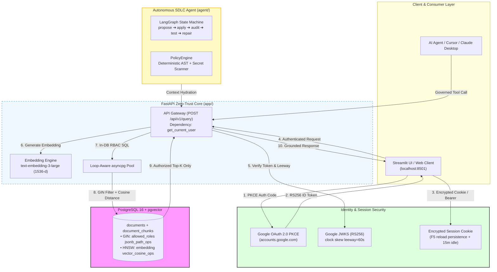

# 🛡️ Enterprise Zero-Trust RAG & Autonomous SDLC

> **Architect:** **[Ken Wong](https://www.linkedin.com/in/kenwong-architect/)**  
> An enterprise-grade, shift-left reference implementation combining **In-Database Zero-Trust Vector RBAC** with an **Autonomous Self-Healing SDLC Agent**.

---

## 🚀 Live Interactive Artifacts

| Component | Description | Access Link |
| :--- | :--- | :--- |
| **Interactive UI** | Shift-Left In-Database RBAC & Session Monitor | [enterprise-rag-pgvector-rbac.streamlit.app](https://enterprise-rag-pgvector-rbac.streamlit.app) |
| **API Docs** | Live OpenAPI / Interactive Swagger UI | [enterprise-rag-api-ksez.onrender.com/docs](https://enterprise-rag-api-ksez.onrender.com/docs) |
| **Source Code** | Auditable Source Repository & Offline Test Suite | [github.com/Kenono2000/enterprise-rag-pgvector-rbac](https://github.com/Kenono2000/enterprise-rag-pgvector-rbac) |
| **Deep-Dive Guide** | Exhaustive Implementation & Troubleshooting Manual | [`project_technical_guide.md`](project_technical_guide.md) |

---

## 💡 The Core Value: Why In-Database RBAC?

Traditional enterprise RAG architectures filter permissions **after** vector retrieval in application memory. This creates two catastrophic flaws:

```
❌ Standard Post-Filtering:
[Query] ──► [Vector DB: Top-K] ──► [Python App Filters by Role] ──► [LLM Context]
                                          │
                                          └─► Context Eviction & Memory Leaks

✅ Zero-Trust In-Database RBAC:
[Query] ──► [Verified JWT] ──► [PostgreSQL: GIN Filter + HNSW Scan] ──► [LLM Context]
                                          │
                                          └─► Unauthorized data never leaves DB
```

1. **Eliminates Recall Starvation**: If top-$K$ documents belong to restricted tiers, post-filtering drops them all in Python memory—returning zero results even when authorized lower-ranked documents exist.
2. **Zero Memory Leaks**: In-database RBAC executes `WHERE allowed_roles ?| $user_roles` **before** vector distance calculation. Unauthorized documents are never read from disk into buffer cache, never sent over TLS, and never loaded into application RAM.

---

## 🏛️ System Architecture


```mermaid
flowchart TB
    subgraph Client ["Client & Consumer Layer"]
        browser["Streamlit UI / Web Client<br/>(localhost:8501)"]
        mcp_client["AI Agent / Cursor / Claude Desktop"]
    end

    subgraph Identity ["Identity & Session Security"]
        google["Google OAuth 2.0 PKCE<br/>(accounts.google.com)"]
        jwks["Google JWKS (RS256)<br/>clock skew leeway=60s"]
        cookie["Encrypted Session Cookie<br/>(F5 reload persistence + 15m idle)"]
    end

    subgraph Backend ["FastAPI Zero-Trust Core (app/)"]
        api["API Gateway (POST /api/v1/query)<br/>Dependency: get_current_user"]
        embed["Embedding Engine<br/>text-embedding-3-large (1536-d)"]
        pool["Loop-Aware asyncpg Pool"]
    end

    subgraph Database ["PostgreSQL 16 + pgvector"]
        db[("documents + document_chunks<br/>• GIN: allowed_roles jsonb_path_ops<br/>• HNSW: embedding vector_cosine_ops")]
    end

    subgraph Agent ["Autonomous SDLC Agent (agent/)"]
        langgraph["LangGraph State Machine<br/>propose ➔ apply ➔ audit ➔ test ➔ repair"]
        guardrails["PolicyEngine<br/>Deterministic AST + Secret Scanner"]
    end

    browser -->|1. PKCE Auth Code| google
    google -->|2. RS256 ID Token| browser
    browser -->|3. Encrypted Cookie / Bearer| cookie
    browser -->|4. Authenticated Request| api
    api -->|5. Verify Token & Leeway| jwks
    api -->|6. Generate Embedding| embed
    api -->|7. In-DB RBAC SQL| pool
    pool -->|8. GIN Filter + Cosine Distance| db
    db -->|9. Authorized Top-K Only| api
    api -->|10. Grounded Response| browser

    mcp_client -->|Governed Tool Call| api
    Agent -->|Context Hydration| api

    style Database fill:#f9f,stroke:#333,stroke-width:2px
    style Identity fill:#dfd,stroke:#333,stroke-width:2px
    style Backend fill:#f0f8ff,stroke:#007acc,stroke-dasharray: 5 5
    style Agent fill:#fff9c4,stroke:#fbc02d,stroke-width:2px
```

---

## 🧱 Architectural Pillars (The 6 Layers)

### 1. Database Layer: Normalized pgvector + Dual Indexing (`schema.sql` & `app/db/`)
* **Normalized Schema Design**: De-couples master document metadata (`documents`) from vector embeddings (`document_chunks`) using a foreign key with `ON DELETE CASCADE`. Eliminates duplicate metadata storage and simplifies document updates.
* **Dual Indexing & Fast Lookups**:
  * **HNSW Vector Index**: Approximate nearest neighbor search (`vector_cosine_ops`, $m=16$, $ef=64$) on `document_chunks.embedding`.
  * **GIN Role Index**: Fast JSONB role membership checks (`jsonb_path_ops`) on `documents.allowed_roles`.
  * **B-Tree File Hash Index**: Instant cryptographic de-duplication lookups on `documents.file_hash`.
* **The Core In-DB RBAC Query (Parameterized & Injection-Proof)**:
  ```sql
  SELECT d.document_id, d.title, c.content, d.allowed_roles, 
         1 - (c.embedding <=> $1::vector) AS similarity
  FROM document_chunks c
  JOIN documents d ON c.document_id = d.id
  WHERE d.allowed_roles ?| $2::text[]
    AND (c.embedding_model = 'text-embedding-3-large' OR c.embedding_model IS NULL)
  ORDER BY c.embedding <=> $1::vector LIMIT $3;
  ```
* **Zero-Trust Short-Circuiting**: Callers without validated roles immediately receive empty results (`[]`) without executing a database query.
* **Defense-in-Depth Sanitization**: Vector search roles are sanitized against `KNOWN_ROLES` and identifier syntax, dropping SQL injection strings before binding to `$2::text[]`.
* **Matryoshka 1536-d Truncation**: Truncates `text-embedding-3-large` from 3072 to 1536 dimensions, slashing PostgreSQL disk and RAM usage by **50%** while preserving **>98%** recall.
* **Loop-Aware Connection Pool**: `asyncpg` pools recycle automatically when Streamlit event loops restart, eliminating `RuntimeError: Event loop is closed`.

### 2. Ingestion Pipeline: Cryptographic De-duplication & Resilient Embeddings (`scripts/ingest.py` & `libs/utilities.py`)
* **Cryptographic SHA-256 De-duplication**: Computes file hashes in 64KB memory-safe blocks (`compute_file_hash()`). Skips unchanged files and re-indexes updated files, avoiding redundant vector generation.
* **Semantic Boundary Chunking**: Employs `RecursiveCharacterTextSplitter.from_tiktoken_encoder` with token boundaries (512–800 tokens, 10–15% overlap) and specialized markdown and table-preserving separators (`\n## `, `\n### `, `\n|`, `\n\n`).
* **Complete Chunk Metadata Attribution**: Automatically attaches `page`, `chunk_index`, `source`, `document_id`, and `chunk_id` to each chunk for precise citation tracking and granular retrieval.
* **Resilient Batched Embeddings with Exponential Backoff**: Batches chunk embeddings (64–128 items per call) using `tenacity` retry with exponential backoff (2s–60s) across transient rate limits (`429`) and server errors (`503`/`500`).
* **CLI Control**: Supports `--force` flag to force re-ingestion and `--batch-size` flag for fine-grained throughput tuning.

### 3. Identity & Session Security (`app/auth/`)
* **Enterprise JWKS Verification**: Verifies tokens against Google JWKS or custom enterprise IdPs (`OIDC_JWKS_URI` / `OIDC_ISSUER`), enforcing strict issuer checks to prevent JWKS cache poisoning.
* **Multi-Source Role Claim Extraction**: `extract_roles()` extracts and normalizes claims from `app_roles`, `roles`, `groups`, `cognito:groups`, and `realm_access.roles` (Azure AD, Okta, Firebase, AWS Cognito, Keycloak).
* **RFC 7636 OAuth 2.0 PKCE**: Uses cryptographic `code_verifier` and SHA-256 challenges for public web applications.
* **Stateless HMAC-SHA256 State**: Embeds verifier and timestamp into signed state tokens (`{b64_data}.{sig}`). Immune to browser redirects, process recycles, and multi-worker scale-outs without Redis.
* **Encrypted Cookie Session Persistence**: Serializes credentials into a `zlib`-compressed, HMAC-signed browser cookie so page reloads (**F5**) stay signed in.
* **SOC-2 / HIPAA Regulatory Guardrails**:
  * **15-Minute Sliding Inactivity Timeout**: DOM event listeners detect keyboard/mouse idle time, wiping credentials and forcing logout at 15 minutes.
  * **12-Hour Absolute Session Ceiling**: Enforces full re-authentication every 12 hours.
  * **Silent Token Refresh**: Re-mints ID tokens silently in the background when approaching expiration.

### 4. API & Shift-Left Frontend (`app/main.py` & `streamlit_app.py`)
* **FastAPI Dependency Injection**: Endpoints enforce `get_current_user` with `leeway=60s` clock-skew tolerance to absorb minor NTP drift.
* **Mathematical Confidence Scoring**: Citations compute an auditable certainty metric:
  $$\text{confidence} = \frac{1}{N} \sum_{i=1}^N \left(1 - (\text{embedding}_i \Leftrightarrow \text{query\_vec})\right)$$
* **Streamlit Shift-Left UI**: Native sandbox-compliant OAuth button, live RBAC SQL inspector, token copy drawer for Swagger UI, and session security monitor.

### 5. FastMCP Agent Gateway (`app/mcp/`)
* **Standardized AI Integration**: Connects external AI agents (Cursor, Claude Desktop) via the Model Context Protocol.
* **Governed Tools**: `search_sdlc_context` verifies Google ID tokens and applies in-database RBAC; `propose_patch` validates submitter claims.
* **Operational Budget Policies**: `policy://sdlc-budget` serves explicit token ceilings (`50,000` tokens/issue) and step caps (`10`) to prevent infinite agentic execution loops.

### 6. Autonomous Self-Healing SDLC Agent (`agent/`)
* **LangGraph State Machine**: Coordinates an autonomous lifecycle:
  $$\text{propose\_patches} \longrightarrow \text{apply\_patches} \longrightarrow \text{audit\_patches} \longrightarrow \text{run\_tests} \longrightarrow \text{repair\_patches} \longrightarrow \text{finalize}$$
* **Deterministic AST Guardrails**: Python `ast.walk` blocks execution sinks (`eval()`, `exec()`, `__import__()`) before running code.
* **Secret Scrubbing**: Compiled regex filters intercept exposed API keys and private keys before commit.
* **Closed-Loop Pytest Self-Healing**: On test failure, slices trailing error tracebacks into the prompt to autonomously repair code and re-verify.

---

## ⚡ 5-Minute Quickstart

### 1. Environment Setup
```powershell
# Clone repository
git clone https://github.com/Kenono2000/enterprise-rag-pgvector-rbac.git
cd enterprise-rag-pgvector-rbac

# Create isolated virtual environment
python -m venv .venv
.\.venv\Scripts\Activate.ps1
python -m pip install -r requirements.txt
```

### 2. Run Automated Verification (81/81 Tests)
All tests run **100% offline** with zero external network or API dependencies:
```powershell
python -m pytest -v
```

### 3. Launch Services
```powershell
# Start PostgreSQL 16 + pgvector container
docker compose up -d postgres

# Start FastAPI Microservice (Port 8000)
python -m uvicorn app.main:app --host 0.0.0.0 --port 8000 --reload
# 📖 Swagger UI: http://localhost:8000/docs

# Start Streamlit UI (Port 8501)
python -m streamlit run streamlit_app.py --server.port 8501
# 🖥️ Web App: http://localhost:8501

# Start FastMCP Gateway
python -m app.mcp
```

---

## 🧪 Test Suite Overview (81 Passing Tests)

```text
tests/test_agent.py          ......                                           [  7%]
tests/test_auth.py           ..................................               [ 49%]
tests/test_database_schema.py ......                                          [ 56%]
tests/test_ingest.py         .........                                        [ 67%]
tests/test_mcp_auth.py       ..........                                       [ 80%]
tests/test_rag.py            ....                                             [ 85%]
tests/test_security_rbac.py   .....                                            [ 91%]
tests/test_utilities.py      .......                                          [100%]
============================== 81 passed in 16.60s ==============================
```

* **`test_database_schema.py` (6 tests)**: Normalized table definitions (`documents`, `document_chunks`), HNSW and GIN index specifications, cascading deletes, file hash lookups, and similarity calculation benchmark simulation.
* **`test_security_rbac.py` (5 tests)**: Dedicated security test suite verifying SQL injection immunity, parameterized array execution (`$2::text[]`), zero-trust empty role short-circuiting, and API header validation.
* **`test_auth.py` (34 tests)**: PKCE verification, stateless HMAC tokens, JWKS leeway, multi-source claim extraction (`groups`, `roles`, `app_roles`, `cognito:groups`, `realm_access`), enterprise JWKS issuer validation, and **session cookie compression/tampering/expiry tests**.
* **`test_rag.py` (4 tests)**: FastAPI endpoints, 401 unauthorized rejection, dev role fallbacks, and in-database RBAC retrieval.
* **`test_mcp_auth.py` (10 tests)**: FastMCP ID token authentication, role extraction, and tool execution governance.
* **`test_agent.py` (6 tests)**: GitHub webhook HMAC verification, AST execution sink blocks, secret scanning, sandbox traversal defense, and LangGraph self-healing loop.
* **`test_ingest.py` (9 tests)**: Cryptographic SHA-256 de-duplication, modified file re-indexing detection, force flag bypass, stem matching, and chunk prefix detection.
* **`test_utilities.py` (7 tests)**: Multi-format loaders (`.pdf`, `.md`, `.docx`), tokenizer-aware chunk splitting, chunk metadata attribution, 64KB block hashing, and tenacity retry on 429 rate limits.

---

## 🛠️ Solved Engineering Pitfalls

| Issue | Root Cause | Engineering Solution |
| :--- | :--- | :--- |
| **SQL Injection in RBAC Filtering** | String-formatting user roles into SQL queries (`ARRAY[...]`). | **Parameterized Bindings & Sanitization**: Bound roles to `$2::text[]` via asyncpg, added zero-trust short-circuit on empty roles, and sanitized claims against `KNOWN_ROLES`. |
| **Ingestion Duplication & Edits Missed** | Filename-only prefix checks missed file edits and duplicated renamed files. | **Cryptographic SHA-256 De-duplication**: 64KB block hashing with change detection skips identical files and purges obsolete chunk sets on re-indexing. |
| **Embedding API Rate Limits (429/503)** | Unbatched or unprotected embedding requests hit provider rate limits. | **Tenacity Exponential Backoff & 64-Item Batching**: Batch-embeds 64–128 items with automated exponential backoff (2s–60s) on transient 429/503 errors. |
| **OAuth State Mismatch** | Streamlit re-creates session on navigation to Google. | **Stateless HMAC-SHA256 State**: Encodes verifier & timestamp; zero server memory dependency. |
| **F5 Reload Requiring Login** | Ephemeral Streamlit WebSocket memory is cleared on refresh. | **Encrypted Session Cookie**: Compresses & HMAC-signs session data; auto-rehydrates via `st.context.cookies`. |
| **`ImmatureSignatureError`** | Clock skew between local machine and Google NTP servers. | Configured `leeway=60` in `jwt.decode()` per RFC 7519. |
| **Pip Dependency Conflict** | Duplicate `PyJWT` pins in `requirements.txt`. | Pruned duplicate, locking strictly to `PyJWT==2.10.1`. |
| **`RuntimeError: Event loop closed`** | Streamlit tears down async event loops between reruns. | Loop-aware connection manager recycles stale `asyncpg` pools automatically. |
| **Context Eviction in RAG** | Post-filtering drops top-$K$ restricted documents. | **In-Database RBAC**: Evaluates `allowed_roles ?| $user_roles` inside PostgreSQL before vector distance ranking. |

---

## 📖 In-Depth Technical Manual

For comprehensive mathematical formulations, step-by-step GCIP Cloud Function code, token security threat models, and architectural deep-dives:

👉 **[Read the Full Technical Guide (`TECH-GUIDE.md`)](TECH-GUIDE.md)**